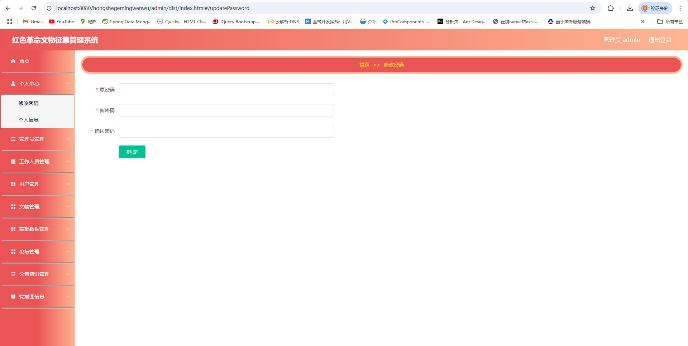

# 一、系统说明

基于MVC模式的红色革命文物征集管理系统,系统功能齐全, 代码简洁易懂，适合小白学编程。

# 二、系统架构

######      前端：vue| elementui

######      后端：springboot | mybatis 

######      环境：jdk1.8+ | mysql8.0 | maven

# 三、代码及数据库

# 四、相关功能介绍

#### 1).客户端

###### 1.登录

###### 2.注册

###### 3.首页

###### 4.文物展示

5.论坛信息

###### 6.公告资讯

###### 7.文物

###### 8.个人中心

###### 9.文物征集

###### 10.文物收藏

###### 11.文物留言

#### 2).管理端

###### 1.登录

###### 2.工作人员注册

###### 3.个人中心->修改密码

###### 4.工作人员管理

包含:修改、详情、删除、新增、查询、重置密码功能

###### 5.用户管理

包含:修改、详情、删除、新增、查询、重置密码功能

###### 6.文物管理

包含:新增、详情、删除、查询功能

###### 7.文物管理->文物留言管理

包含:详情、删除、查询功能

###### 8.文物管理->文物收藏管理

包含:详情、删除、查询功能

###### 9.论坛管理

包含：详情、删帖、查看回复、修改功能

###### 10.公告资讯管理

###### 11.轮播图管理

###### 13.工作人员角色登录

相关功能与管理员内容差不多，功能差异不大

